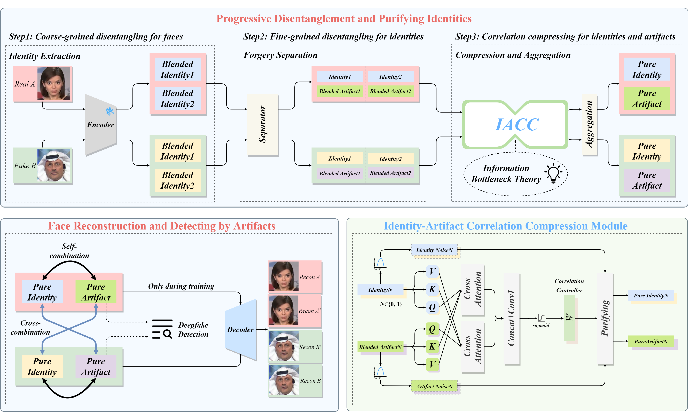

# PDP-Official-Code
## Abstract

> The Deepfake technology has raised serious concerns regarding privacy breaches and trust issues. To tackle these challenges, Deepfake detection technology has emerged. Current methods over-rely on the global feature space, which contains redundant information independent of the artifacts. As a result, existing Deepfake detection techniques suffer performance degradation when encountering unknown datasets. To reduce information redundancy, the current methods use disentanglement techniques to roughly separate the fake faces into artifacts and content information. However, these methods lack a solid disentanglement foundation and cannot guarantee the reliability of their disentangle process. To address these issues, this paper innovatively proposes a Deepfake detection method based on progressive disentangling and purifying blended identities. Based on the artifact generation mechanism, the coarse- and fine-grained strategies are combined to ensure the reliability of the disentanglement method. Our method aims to more accurately capture and separate artifact features in fake faces. Specifically, we first perform coarse-grained disentangling on fake faces to obtain a pair of blended identities that require no additional annotation to distinguish between source face and target face. We then separate the artifact features from each identity to achieve fine-grained disentanglement. To obtain pure identity information and artifacts, an Identity-Artifact Correlation Compression module (IACC) is designed based on the information bottleneck theory, effectively reducing the potential correlation between identity information and artifacts. Additionally, we introduce an Identity-Artifact Separation Contrast Loss to enhance the independence of artifact features post-disentangling. Finally, the classifier only focuses on pure artifact features to achieve a generalized Deepfake detector. Extensive experimental evaluations show that our proposed method achieves superior detection performance and better generalization compared to existing state-of-the-art methods.

This is code for PDP (Progressive Disentangling and Purifying Blended Identities for Deepfake Detection). Our code is actually implemented by [DeepfakeBench](https://github.com/SCLBD/DeepfakeBench), just add the network code, loss function, and configuration file to the Bench to start training.
